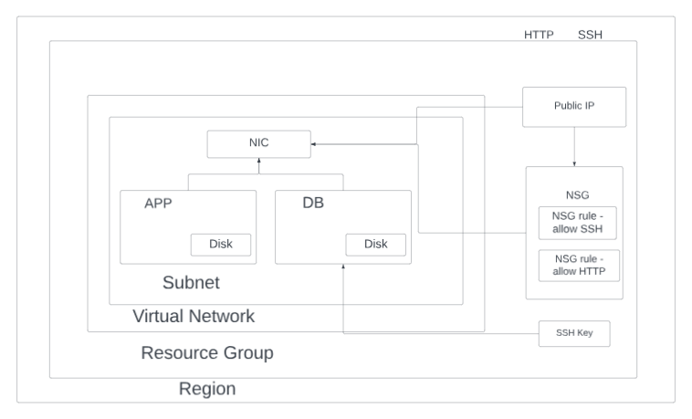

# Azure Hierarchy and Scopes

## Scopes Overview

In Azure, the organization is structured through scopes. The four main scopes are:

1. **Management Groups**
2. **Subscriptions**
3. **Resource Groups**
4. **Resources**


### 1. Management Groups

- The top-most level in the Azure hierarchy.
- Ideal for managing policies and compliance across multiple Azure subscriptions.

### 2. Subscriptions

- Serve as a container for billing and resource management.
- Fall under Management Groups.

### 3. Resource Groups

- Act as containers that group related resources for an Azure solution.

### 4. Resources

- These are individual instances such as virtual machines, databases, or storage accounts.
- Must belong to a Resource Group.

## Azure SLA

- Azure Service Level Agreement (SLA) defines the guaranteed uptime and performance metrics as committed by Microsoft.
- Customers may be eligible for service credits if these commitments are not met.

---


## Difference Between AWS and Azure

### Availability Zones (AZs)

- **AWS**: Available zones in a region are not limited.
- **Azure**: A maximum of 3 AZs in a region.

### Private subnet

Azure private subnets - can connect to outside if initiated by VM, outside cant connect to it.

In azure, anything within the virtual network can talk to each other by default

NSG lets them through - rule: allows all virtual network traffic in and out

### Two tier architecture




## System Routes

System routes are the default routes provided by Azure to allow communication within a virtual network, and to communicate to the Azure infrastructure.

**By default, Azure allows the following routes for system routes:**

1. **VNet-to-VNet Communication**: All Azure Virtual Networks are isolated from each other. However, within a VNet, all subnets can communicate with each other by default

2. **Internet Communication**: By default, resources in a VNet can initiate outbound connectivity to the Internet. This allows resources like VMs to access public updates, patches, or software downloads.

3. **Virtual Appliances**: Azure allows for the use of virtual appliances (like firewalls or WAN optimizers). These appliances can be placed in a subnet and traffic can be routed through them.

---

## User-defined Routes (UDR) or Custom Routes

User-defined routes are custom routes that users can define in Azure to override Azure's default system routes, or to add additional routes to a route table.

**To use UDRs to make a subnet private:**

1. **Create a Route Table**: 
   ```bash
   az network route-table create --name MyRouteTable --resource-group MyResourceGroup --location eastus
   ```

2. **Define a Custom Route**: To block outbound Internet connectivity, point to the virtual network gateway or virtual appliance.
   ```bash
   az network route-table route create --name MyRoute --resource-group MyResourceGroup --route-table-name MyRouteTable --address-prefix 0.0.0.0/0 --next-hop-type VirtualAppliance --next-hop-ip-address <IP_ADDRESS_OF_YOUR_VIRTUAL_APPLIANCE>
   ```

3. **Associate the Route Table to the Subnet**: This ensures that the subnet follows the custom route we defined.
   ```bash
   az network vnet subnet update --name MySubnet --resource-group MyResourceGroup --vnet-name MyVNet --route-table MyRouteTable
   ```

---
