# Azure Hierarchy and Scopes

## Scopes Overview

In Azure, the organization is structured through scopes. The four main scopes are:

1. **Management Groups**
2. **Subscriptions**
3. **Resource Groups**
4. **Resources**

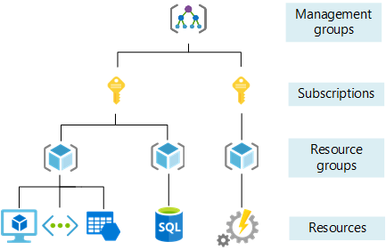

### 1. Management Groups

- The top-most level in the Azure hierarchy.
- Ideal for managing policies and compliance across multiple Azure subscriptions.

### 2. Subscriptions

- Serve as a container for billing and resource management.
- Fall under Management Groups.

### 3. Resource Groups

- Act as containers that group related resources for an Azure solution.

### 4. Resources

- These are individual instances such as virtual machines, databases, or storage accounts.
- Must belong to a Resource Group.

## Azure SLA

- Azure Service Level Agreement (SLA) defines the guaranteed uptime and performance metrics as committed by Microsoft.
- Customers may be eligible for service credits if these commitments are not met.

---

# SSH Key Setup

1. Navigate to [Azure Portal](https://portal.azure.com).
2. Search for "SSH keys."
  
   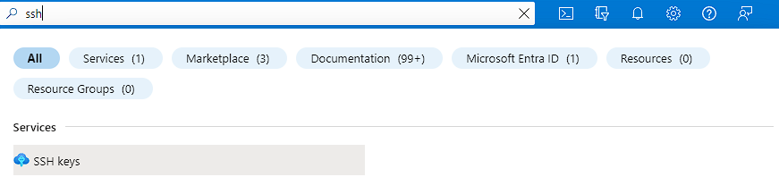

3. Click on "Create."
4. Choose `tech 254` as the resource group.
5. Name the key pair and upload an existing public key.

   ```bash
   cat tech254-anees-az-key.pub | clip
   ```
   
   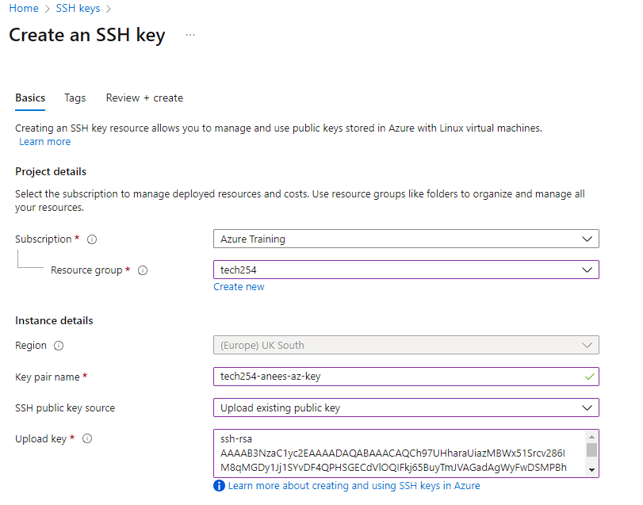

6. Proceed to tags and add an "owner" tag with your name.

   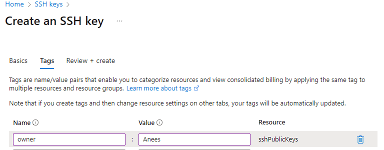

7. Review all settings before creation.

   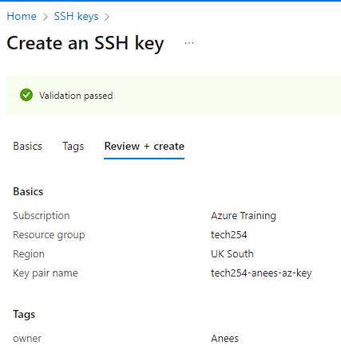

---

# Virtual Network Setup

1. Search for "Virtual Networks" and click "Create."
2. Name it `tech254-anees-app-db-vnet` and set the region to "UK South."

   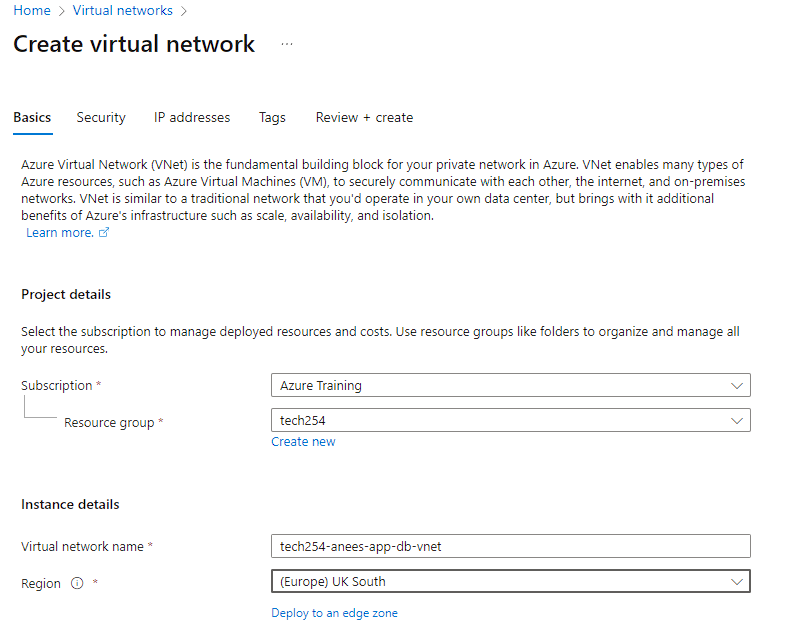

3. Skip Azure Firewall in the security tab.
4. Configure IP addresses.

   - Default Subnet: Rename to `public-subnet` and set starting address to `10.0.2.0/24`.
  
   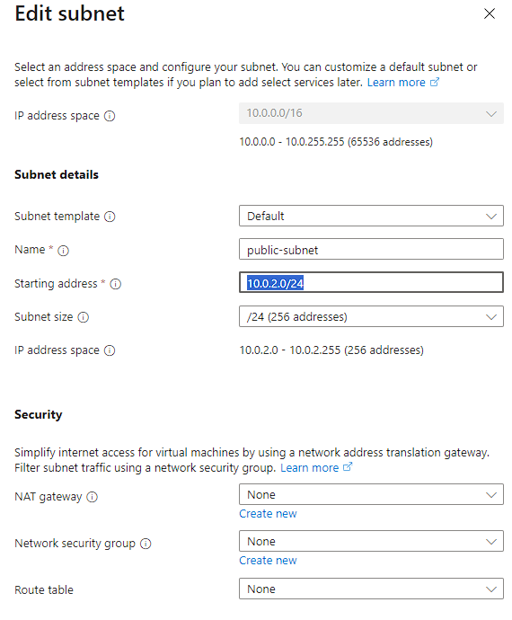

   - Create a new subnet called `private-subnet` with starting address `10.0.3.0/24`.
  
   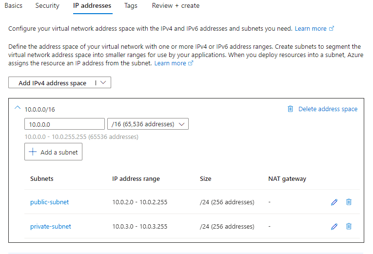

5. Proceed to the tag page, add an "owner" tag with your name.
6. Review all settings.

   

---

# Virtual Machine Setup

1. Search for "Virtual Machine" and click "Create."
2. Configure as follows:

   - Region: UK South
   - Zones: 1
   - Image: **Ubuntu Pro 18.04 LTS (Gen 2)**
  
   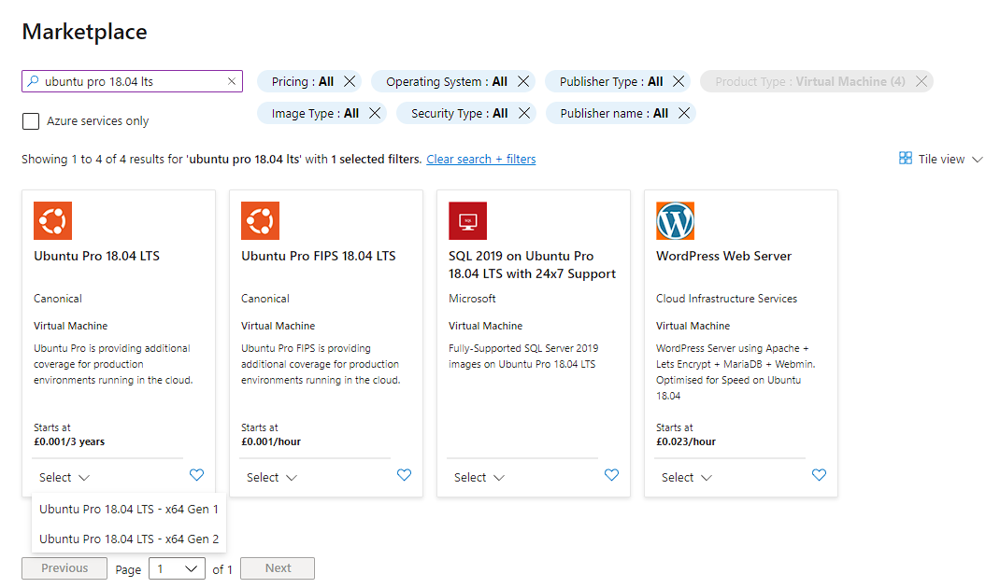

3. Security Type: **Standard**
4. Size: **B1s**

   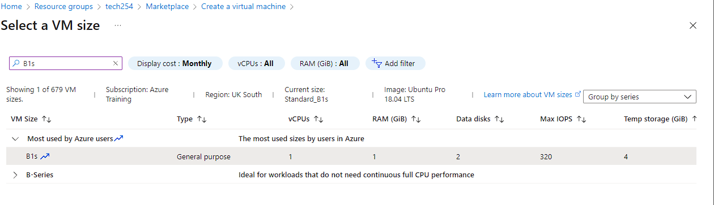

5. Username: `adminuser`
6. SSH Key: Use existing key stored in Azure.
7. Allowed Ports: HTTP and SSH
  
   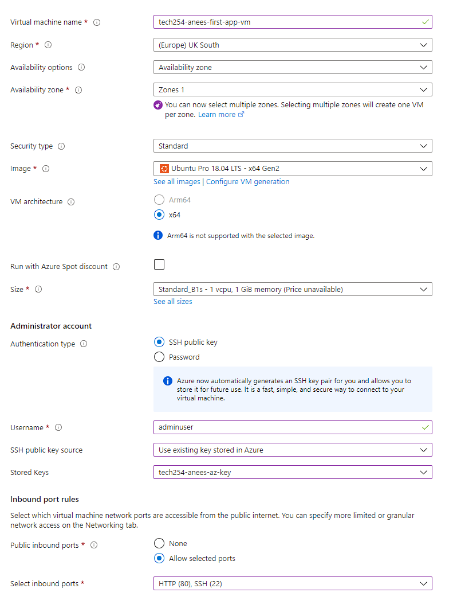

8. Disk: Standard SSD with "Delete with VM" enabled.
  
   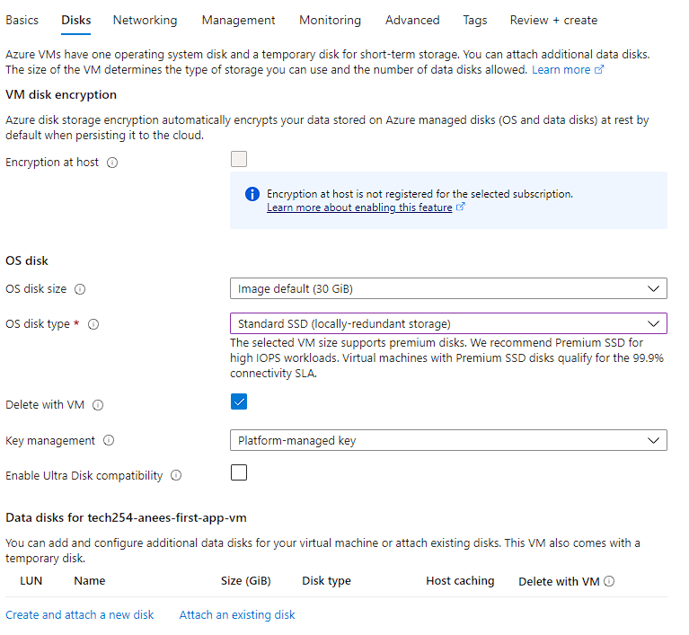

9. Networking: Use your virtual network and public subnet.

   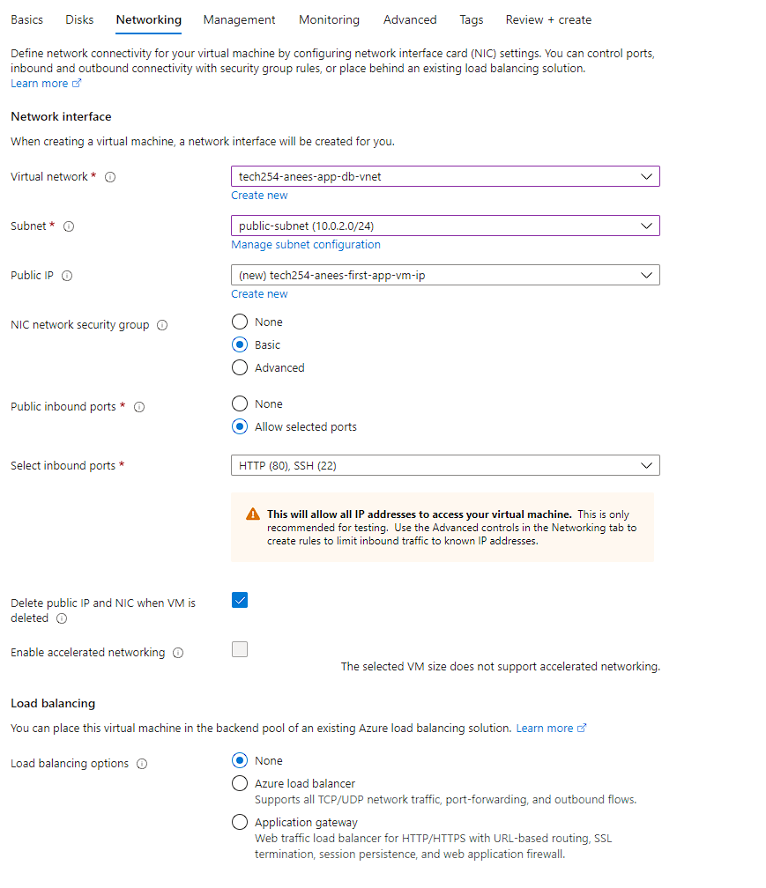

10. User Data: Enable and enter contents of `reverse_proxy_provision.sh`.
11. Add an "owner" tag and review all settings.

---

# Create Resource

- In `tech254` resource group, click "Create" and search for **Ubuntu Pro 18.04 LTS** to create a VM template.

---

# Difference Between AWS and Azure

## Availability Zones (AZs)

- **AWS**: Available zones in a region are not limited.
- **Azure**: A maximum of 3 AZs in a region.
