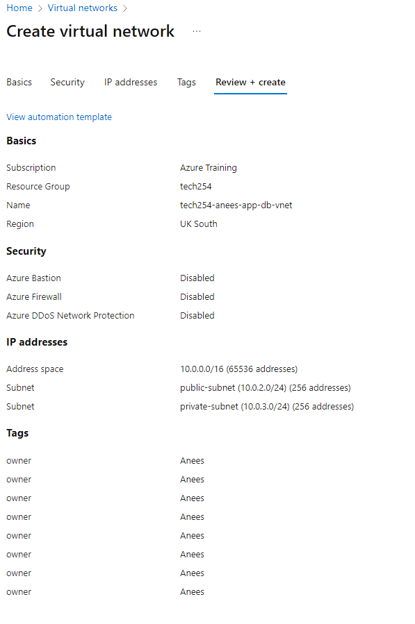
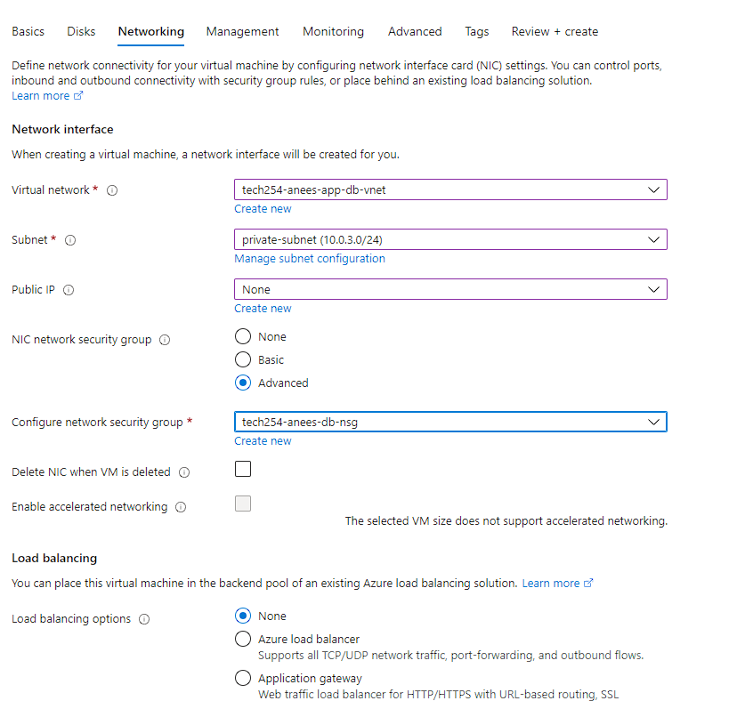
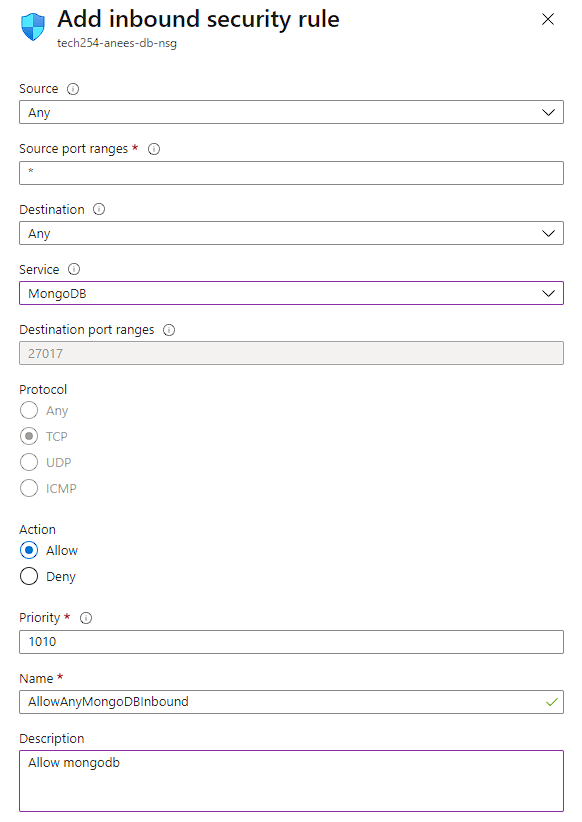
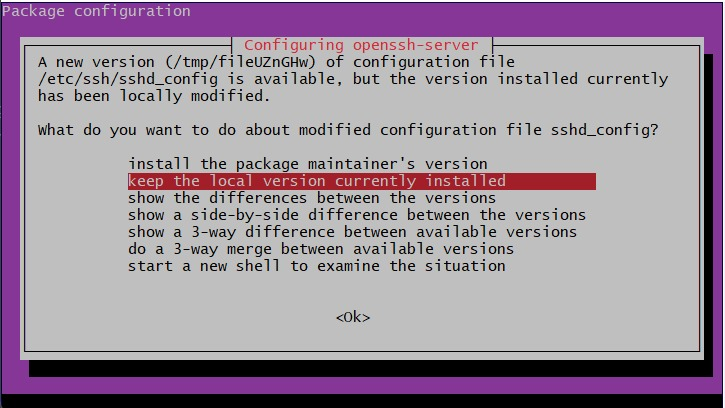

# Azure Hierarchy and Scopes

## Scopes Overview

In Azure, the organization is structured through scopes. The four main scopes are:

1. **Management Groups**
2. **Subscriptions**
3. **Resource Groups**
4. **Resources**


### 1. Management Groups

- The top-most level in the Azure hierarchy.
- Ideal for managing policies and compliance across multiple Azure subscriptions.

### 2. Subscriptions

- Serve as a container for billing and resource management.
- Fall under Management Groups.

### 3. Resource Groups

- Act as containers that group related resources for an Azure solution.

### 4. Resources

- These are individual instances such as virtual machines, databases, or storage accounts.
- Must belong to a Resource Group.

## Azure SLA

- Azure Service Level Agreement (SLA) defines the guaranteed uptime and performance metrics as committed by Microsoft.
- Customers may be eligible for service credits if these commitments are not met.

---

# SSH Key Setup

1. Navigate to [Azure Portal](https://portal.azure.com).
2. Search for "SSH keys."
  
   

3. Click on "Create."
4. Choose `tech 254` as the resource group.
5. Name the key pair and upload an existing public key.

   ```bash
   cat tech254-anees-az-key.pub | clip
   ```
   
   

6. Proceed to tags and add an "owner" tag with your name.

   

7. Review all settings before creation.

   

---

# Virtual Network Setup

1. Search for "Virtual Networks" and click "Create."
2. Name it `tech254-anees-app-db-vnet` and set the region to "UK South."

   

3. Skip Azure Firewall in the security tab.
4. Configure IP addresses.

   - Default Subnet: Rename to `public-subnet` and set starting address to `10.0.2.0/24`.
  
   

   - Create a new subnet called `private-subnet` with starting address `10.0.3.0/24`.
  
   

5. Proceed to the tag page, add an "owner" tag with your name.
6. Review all settings.

   

---
Certainly! Here's the reorganized version where the "Database Setup" section now shares the first 8 steps with the "App Setup" section, and the "App Setup" section refers back to the "Database Setup" for those steps.

---

## Common Setup Steps for Database and App

1. Search for "Virtual Machine" and click "Create."
2. Configure the basic settings:

   - Region: UK South
   - Zones: 1
   - Image: **Ubuntu Pro 18.04 LTS (Gen 2)**
  
   

3. Choose Security Type: **Standard**
4. Pick the Size: **B1s**

   

5. Set the Username: `adminuser`
6. SSH Key: Use an existing key stored in Azure.
7. Configure Allowed Ports: HTTP and SSH
  
   

8. Disk Options: Select Standard SSD with the "Delete with VM" option enabled.

   

---

## Database Setup

Follow the Common Setup Steps 1-8 above, then proceed with the following:

9. Networking: Configure the VM to reside on the private subnet, ensuring that no public IP is set.

   

10. Configure NSG settings:

    - Under "Configure NSG," select "Create New."
    - Choose "MongoDB" from the service dropdown.
  
    

11. Advanced Settings:
   
    - Under "User Data," insert the contents of the `mongodb_automation` script.

---

## App Setup

Follow the Common Setup Steps 1-8 above, then continue:

9. Networking: Use your virtual network and public subnet.

   

10. User Data: Enable and insert the contents of `azure_script.sh`. Paste the private IP of the database into the `DB_HOST` variable.
11. Add an "owner" tag and review all settings.

### Blocker

While attempting to run `sudo apt upgrade` on my system, I was consistently interrupted by a `debconf` dialog. 

To bypass this prompt and automate the upgrade process:
1. I set the `DEBIAN_FRONTEND` variable to `noninteractive`, which ensured `debconf` wouldn't pause and wait for my input.
2. I added the `Dpkg::Options::="--force-confnew"` option when using `apt`. This automatically accepts the package maintainer's version of the configuration file during upgrades.



---


### Create Resource

- In `tech254` resource group, click "Create" and search for **Ubuntu Pro 18.04 LTS** to create a VM template. This is useful if we run into any blockers that stop us from using 18.04

---

## Difference Between AWS and Azure

### Availability Zones (AZs)

- **AWS**: Available zones in a region are not limited.
- **Azure**: A maximum of 3 AZs in a region.
