# SSH Key Setup

1. Navigate to [Azure Portal](https://portal.azure.com).
2. Search for "SSH keys."
  
   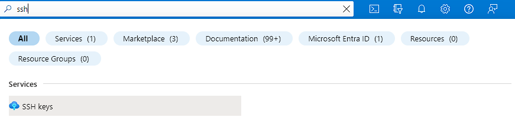

3. Click on "Create."
4. Choose `tech 254` as the resource group.
5. Name the key pair and upload an existing public key.

   ```bash
   cat tech254-anees-az-key.pub | clip
   ```
   
   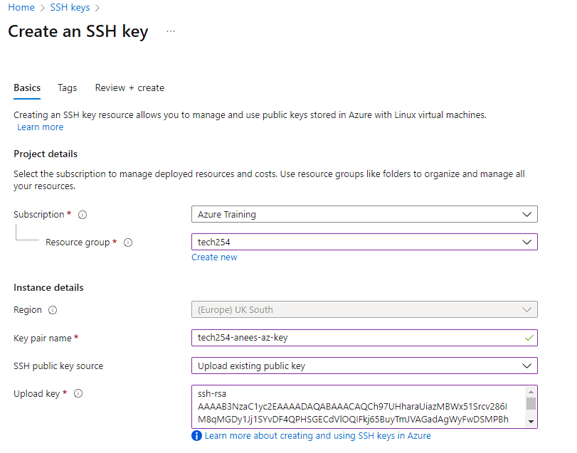

6. Proceed to tags and add an "owner" tag with your name.

   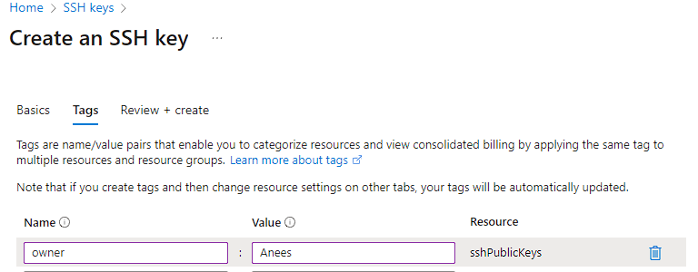

7. Review all settings before creation.

   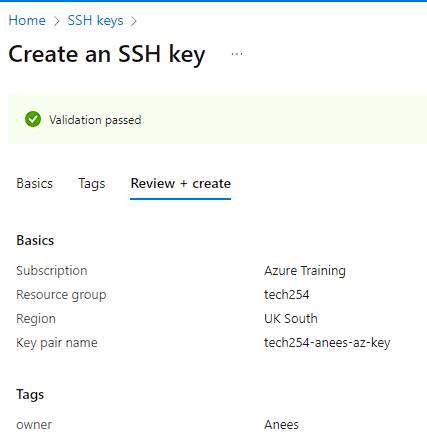

---

# Virtual Network Setup

1. Search for "Virtual Networks" and click "Create."
2. Name it `tech254-anees-app-db-vnet` and set the region to "UK South."

   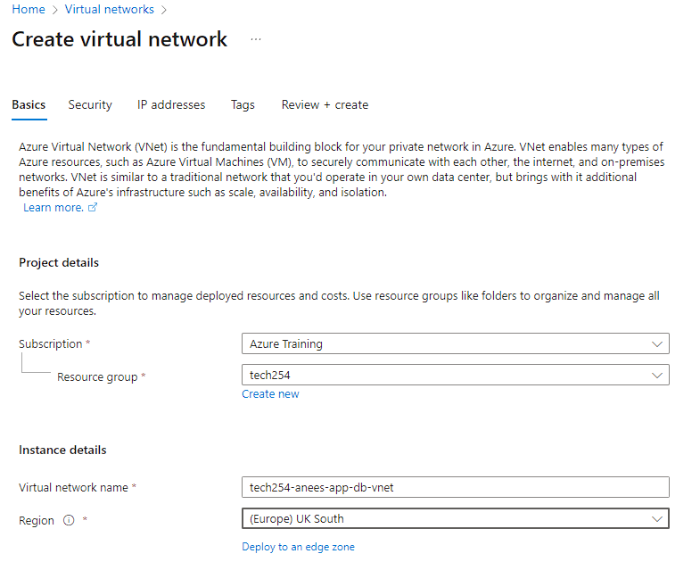

3. Skip Azure Firewall in the security tab.
4. Configure IP addresses.

   - Default Subnet: Rename to `public-subnet` and set starting address to `10.0.2.0/24`.
  
   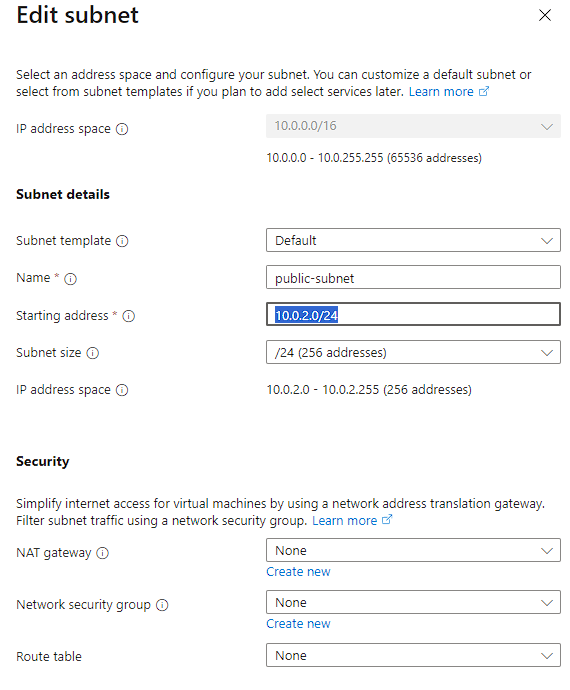

   - Create a new subnet called `private-subnet` with starting address `10.0.3.0/24`.
  
   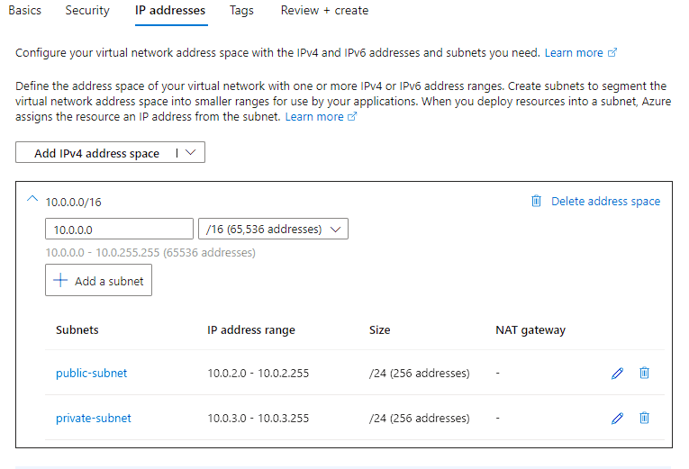

5. Proceed to the tag page, add an "owner" tag with your name.
6. Review all settings.

   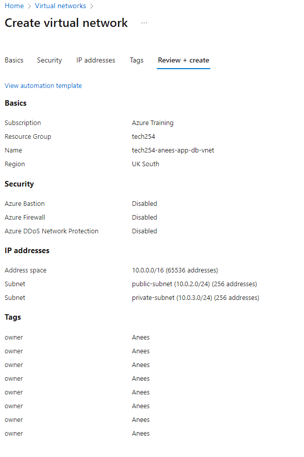

---


---

## Common Setup Steps for Database and App

1. Search for "Virtual Machine" and click "Create."
2. Configure the basic settings:

   - Region: UK South
   - Zones: 1
   - Image: **Ubuntu Pro 18.04 LTS (Gen 2)**
  
   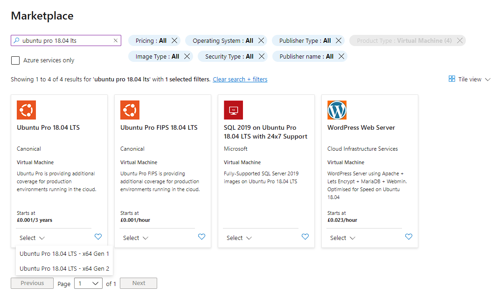

3. Choose Security Type: **Standard**
4. Pick the Size: **B1s**

   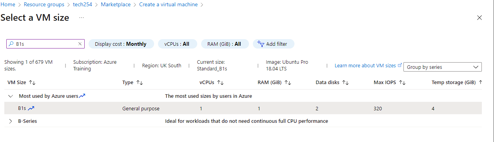

5. Set the Username: `adminuser`
6. SSH Key: Use an existing key stored in Azure.
7. Configure Allowed Ports: HTTP and SSH
  
   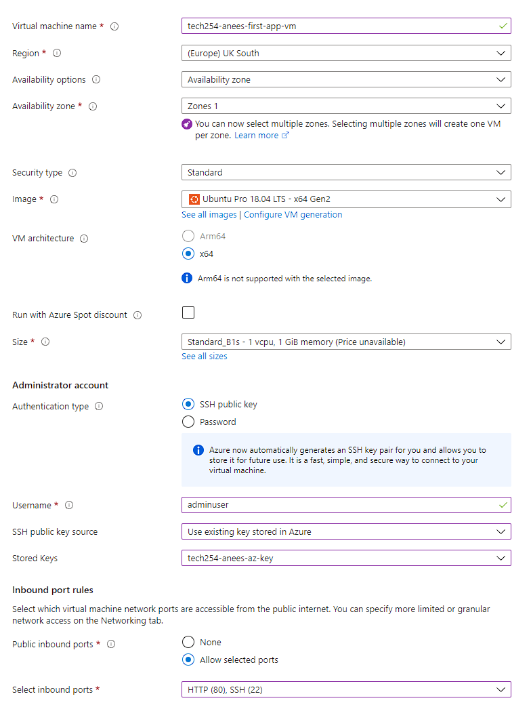

8. Disk Options: Select Standard SSD with the "Delete with VM" option enabled.

   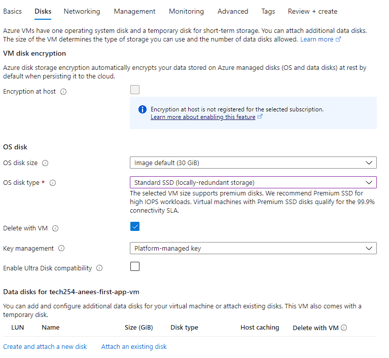

---

## Database Setup

Follow the Common Setup Steps 1-8 above, then proceed with the following:

9. Networking: Configure the VM to reside on the private subnet, ensuring that no public IP is set.

   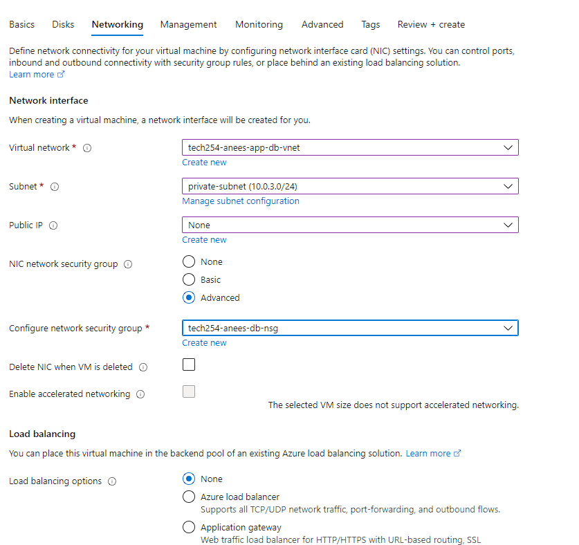

10. Configure NSG settings:

    - Under "Configure NSG," select "Create New."
    - Choose "MongoDB" from the service dropdown.
  
    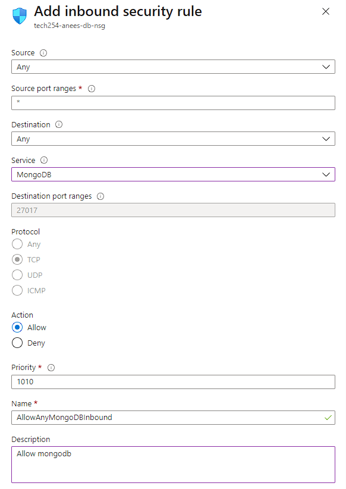

11. Advanced Settings:
   
    - Under "User Data," insert the contents of the `mongodb_automation` script.

---

## App Setup

Follow the Common Setup Steps 1-8 above, then continue:

9. Networking: Use your virtual network and public subnet.

   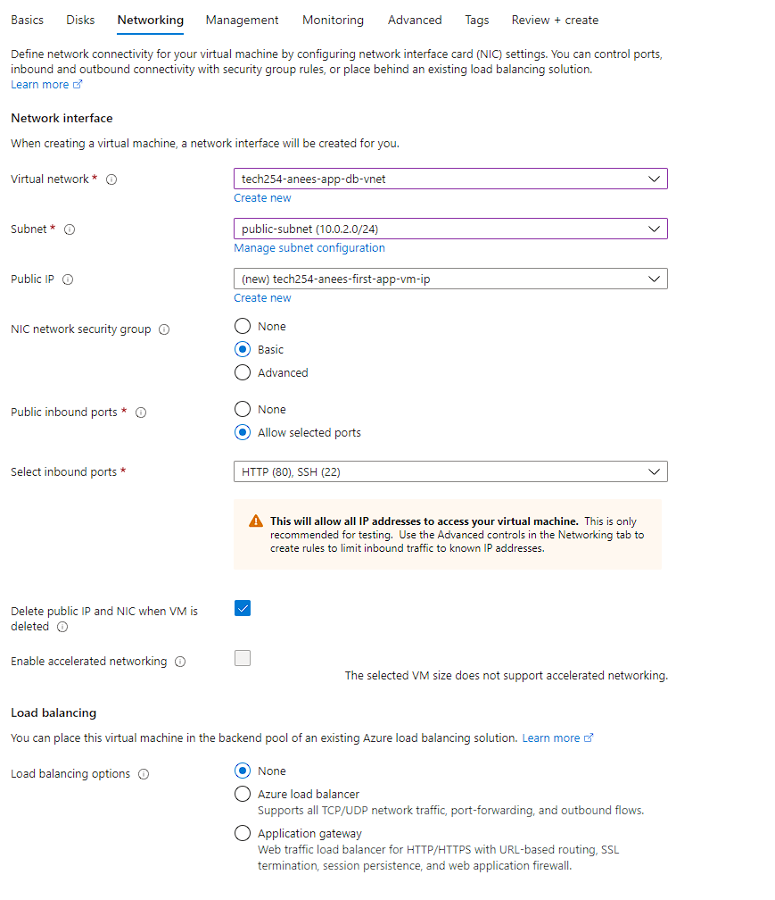

10. User Data: Enable and insert the contents of `azure_script.sh`. Paste the private IP of the database into the `DB_HOST` variable.
11. Add an "owner" tag and review all settings.

### Blocker

While attempting to run `sudo apt upgrade` on my system, I was consistently interrupted by a `debconf` dialog. 

To bypass this prompt and automate the upgrade process:
1. I set the `DEBIAN_FRONTEND` variable to `noninteractive`, which ensured `debconf` wouldn't pause and wait for my input.
2. I added the `Dpkg::Options::="--force-confnew"` option when using `apt`. This automatically accepts the package maintainer's version of the configuration file during upgrades.


---

### Create Resource

- In `tech254` resource group, click "Create" and search for **Ubuntu Pro 18.04 LTS** to create a VM template. This is useful if we run into any blockers that stop us from using 18.04

---

### Making private network more secure

1. **Navigate to the Database Virtual Machine (VM)**:

2. **Access Network Security Group (NSG) Settings**: Within the VM's dashboard, search for the Network Security Group (NSG) settings. 

3. **Modify or Add a Rule**: 
To modify an existing rule, click on the name of that rule to access its settings. 

5. **Adjust the 'Source' Setting**: In the rule settings, locate the 'Source' option. Change its value to 10.0.2.0/24.

6. **Set a High Priority Value**: The priority value determines the order in which rules are applied, with lower numbers being processed first. To ensure your rule takes precedence over others, assign it a priority value lower than the ones already listed ( in this case 300)

7. **Finalize and Save**


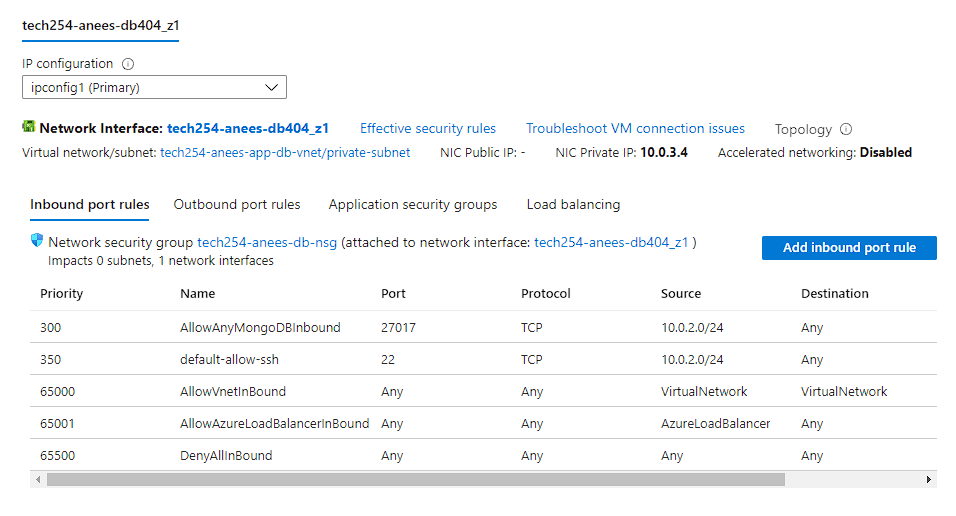

### Unassociated Public IP from NIC:

1. Navigate to "Virtual machines" and click on the VM you are interested in.
2. Under "Settings", click on "Networking".
3. You will see a list of Network Interface Cards (NICs). Click on the NIC that is associated with the Public IP you want to remove.
4. Under the NIC settings, click on "IP configurations".
5. Click on the IP configuration that is associated with the Public IP.
6. Deselect the associate public ip address and click "Save".

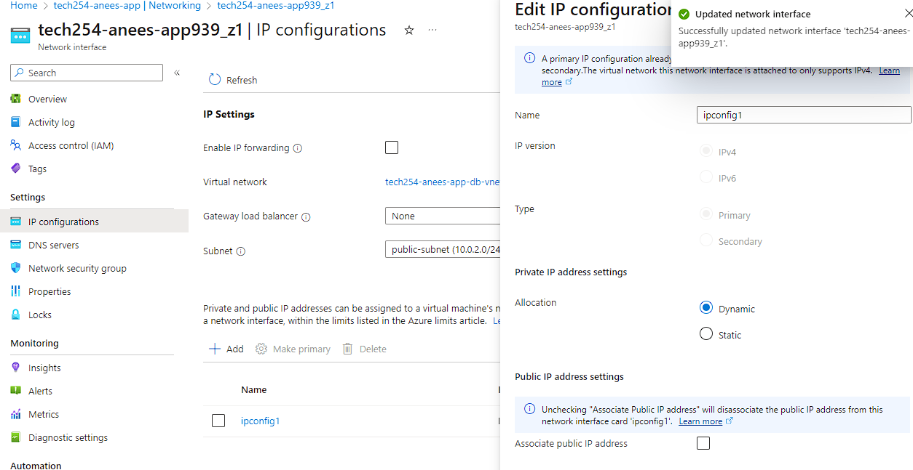

