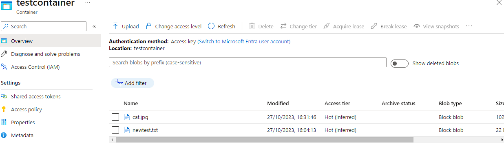
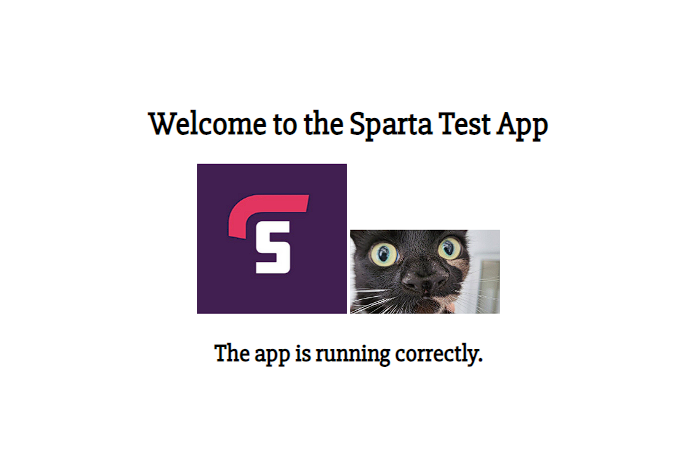

## Using Blob Storage

### Install Azure CLI
To get started, first install the Azure Command-Line Interface (CLI) using the following command:
```bash
curl -sL https://aka.ms/InstallAzureCLIDeb | sudo bash
```

### Login to Azure Account
Log in to your Azure account using:
```bash
az login
```
You should see a screen similar to this:


### Create Azure Storage Account
Create a new storage account using the following command:
```bash
az storage account create --name tech254aneesstorage --resource-group tech254 --location uksouth --sku Standard_ZRS
```

### Create a Storage Container
Create a container named `testcontainer` in the storage account you just created:
```bash
az storage container create \
     --account-name tech254aneesstorage \
     --name testcontainer \
     --auth-mode login
```
**Note**: Make sure you have the appropriate permissions/roles to access containers and blob storage.

### Create a Test Text File
Open a text editor to create a test file:
```bash
nano test.txt
```
Enter some dummy input and save the file.

### Upload Text File to Blob Storage
Upload `test.txt` to your storage container:
```bash
az storage blob upload \
     --account-name tech254aneesstorage \
     --container-name testcontainer \
     --name newtest.txt \
     --file test.txt \
     --auth-mode login
```

### Download an Image
Download a cat image from the web using `curl`:
```bash
curl -o cat.jpg https://ichef.bbci.co.uk/news/976/cpsprodpb/17207/production/_131472749_nannymcphee1.jpg
```

### Upload Image to Blob Storage
Upload `cat.jpg` to your storage container:
```bash
az storage blob upload \
     --account-name tech254aneesstorage \
     --container-name testcontainer \
     --name cat.jpg \
     --file cat.jpg \
     --auth-mode login
```
You should see the following on your blob, indicating successful upload:


### Update Web Page
Use the following command to insert the uploaded `cat.jpg` image into your website's index page:
```bash
sed -i '/<h2>/i\' /home/adminuser/repo/app/views/index.ejs
```

### Restart Application
Kill and restart your application to see the updated page:


---

## User data vs Manually launching

If we try to launch the app manually, after launching it through user data, it will not work. THis because the newly launched app is trying to run on port 3000 when there is already an app running on it.

First we need to kill the pm2 manager, as if we kill the nodejs app the pm2 manager will start another instance. We can search for the pm2 process id using `ps aux | grep pm2`

Here we can see all processes related to pm2.


We need to get the process id, the number next to "root". Then we need to kill the pm2 process using ` sudo kill -9 17285`

If we use `ps aux | grep pm2` again we can see that it no longer exists, this means we are now free to manually launch the app ourselves and it wont have any errors as port 3000 is not longer occupied.

